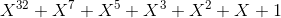
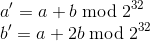
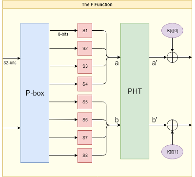
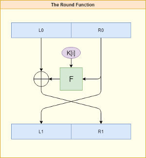
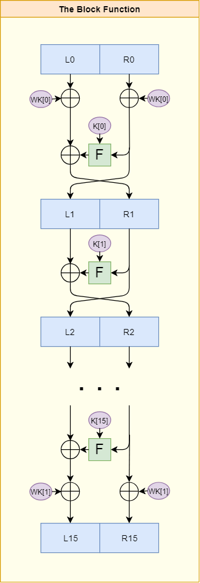

# knifefish128

Knifefish is a 16 round, balanced, Feistel network cipher, with a 128-bit block size.

## Build and Run

This repository contains a command-line proof of concept program meant for testing and benchmarking.

```bash
git clone https://github.com/lib64/knifefish128
cd knifefish128/
make
```

Print Help

```bash
./kf128 -h
```

Run Tests

```bash
python3 test/test_functions.py
```

Encrypt / Decrypt File

```bash
./kf128 -e -i input.txt -o input_encrypted.txt
./kf128 -d -i input_encrypted.txt -o input_decrypted.txt
```

The program will prompt for a password unless it is specified with -p.

```bash
./kf128 -e -i input.txt -o input_encrypted.txt -p "marbles"
```

The program will generate a 16 byte iv from /dev/urandom unless one is specified with -k.

Any iv specified with -k must be exactly 16 bytes.

```bash
./kf128 -e -i input.txt -o input_encrypted.txt -p "marbles" -k "absgdferweadseqw"
```


## Knifefish Algorithm Details

- ##### Linear-Feedback Shift Registers

>**_In computing, a linear-feedback shift register (LFSR) is a shift register whose input bit is a linear function of its previous state. The most commonly used linear function of single bits is exclusive-or (XOR). Thus, an LFSR is most often a shift register whose input bit is driven by the XOR of some bits of the overall shift register value._**
>
>-- [Linear-feedback shift register. In Wikipedia, The Free Encyclopedia. Retrieved 21:33, February 23, 2019](https://en.wikipedia.org/w/index.php?title=Linear-feedback_shift_register&oldid=884707042)

Knifefish uses a 32-bit LFSR to generate pesudo-random numbers.

The LFSR used by Knifefish has the following feedback polynomial:



This LFSR configuration was detailed in the book Applied Cryptography by Bruce Schneier.
On page 375 he writes:

>**_The resultant LFSR will be maximal length; it will cycle through 2^32-1 values before repeating._**
>
>--[Applied Cryptography, 375](https://www.schneier.com/books/applied_cryptography/)


This means that the LFSR used by Knifefish has a period of 4,294,967,295 bits.


- #### P-box

>**_In cryptography, a permutation box (or P-box) is a method of bit-shuffling used to permute or transpose bits across S-boxes inputs, retaining diffusion while transposing._**
>
>-- [Permutation box. In Wikipedia, The Free Encyclopedia. Retrieved 21:36, February 23, 2019](https://en.wikipedia.org/w/index.php?title=Permutation_box&oldid=856976110)

Knifefish has a single P-box which permutes the positions of 8 bytes in the F function. The P-box is an
8 byte array which contains the values 0-7. The values are randomized using a 32-bit seed word which is 
derived from key material.

An example P-box permutation:

```
p-box  = [4,2,7,0,5,1,3,6]
input  = [A,B,C,D,E,F,G,H]
output = [E,C,H,A,F,B,D,G]
```

- #### S-boxes

>**_In cryptography, an S-box (substitution-box) is a basic component of symmetric key algorithms which performs substitution. In block ciphers, they are typically used to obscure the relationship between the key and the ciphertext — Shannon's property of confusion._**
>
>-- [S-box. In Wikipedia, The Free Encyclopedia. Retrieved 21:13, February 23, 2019](https://en.wikipedia.org/w/index.php?title=S-box&oldid=883701806)

Knifefish uses 8 S-boxes to lookup the 8 bytes that result from the P-box permutation. Each S-box is a
256 byte array of values from 0-255. The values in an S-box are randomized using a 32 bit seed word which
is derived from key material. The value of an input byte is used as an index to lookup the value of the 
byte to be returned.

An Example S-box:

```
59 be 47 bd d6 d0 49 f5 c9 ec 45 06 c7 f7 fb 6e 
74 c1 d8 ff e5 64 7c 2b b5 e7 eb cd 39 8b 4c 9b 
ee 99 f3 f2 62 f9 16 50 18 05 a7 fe 08 fd f1 d7 
fa 32 e2 83 13 ea 85 7b 3b e4 68 1b 6f e0 35 d4 
48 24 54 91 15 29 14 1c 8c 5b 65 f4 30 df 2d 6c 
53 66 67 23 b4 11 56 55 46 86 89 5f 12 8d 51 1e 
95 36 b1 09 b7 3c 88 7e 2c 93 cb b2 73 7f 75 10 
94 4a ab 97 5e b3 c2 76 70 d2 b8 c6 a9 3a 77 c3 
aa 01 e1 fc 17 9f 0d f8 0f 63 f0 04 02 00 98 37 
1a d5 40 27 3f ae 60 6d 25 9d dd 6b d3 ca 03 0c 
0a 8e 71 58 bb 22 87 79 07 82 dc 72 28 bc 3e d1 
52 ed 1d 69 92 84 c4 80 ac 61 9a de cf 9e e9 c5 
34 a6 bf 2a 2f cc a8 3d a1 d9 19 ef c8 af 42 7d 
31 57 5d 4e 96 ad a2 38 da 20 b9 ce e8 a5 a3 e6 
9c 6a 8a db 33 e3 7a 41 4b ba 5a 44 8f 78 0e 5c 
a0 90 b0 b6 2e 4f 21 0b c0 26 4d a4 43 f6 1f 81 
```
Using the S-box pictured above, the input byte 0x1F would result in an output byte of 0x9B because 
0x1F is 31 in decimal, and 0x9B occupies the 31st position in the S-box.

- #### Pseudo-Hadamard Transform

>**_The pseudo-Hadamard transform is a reversible transformation of a bit string that provides cryptographic diffusion._**
>
>-- [Pseudo-Hadamard transform. In Wikipedia, The Free Encyclopedia. Retrieved 21:43, February 23, 2019](https://en.wikipedia.org/w/index.php?title=Pseudo-Hadamard_transform&oldid=865012710)

Knifefish performs a 32 bit pseudo-hadamard transform on the two 32-bit words that result from the S-box 
substitution.

The equation is as follows:



- #### Key Whitening

>**_In cryptography, key whitening is a technique intended to increase the security of an iterated block cipher. It consists of steps that combine the data with portions of the key. The most common form of key whitening is xor-encrypt-xor -- using a simple XOR before the first round and after the last round of encryption._**
>
>-- [Key whitening. In Wikipedia, The Free Encyclopedia. Retrieved 21:45, February 23, 2019](https://en.wikipedia.org/w/index.php?title=Key_whitening&oldid=821951647)

Knifefish uses 2 128 bit whitening keys. The first key is xored with the input block before the round 
function is run 16 times. The second key is xored with the result from the final round to produce the 
output.

- #### Key Schedule

>**_In cryptography, the so-called product ciphers are a certain kind of cipher, where the (de-)ciphering of data is typically done as an iteration of rounds. The setup for each round is generally the same, except for round-specific fixed values called a round constant, and round-specific data derived from the cipher key called a round key. A key schedule is an algorithm that calculates all the round keys from the key._**
>
>-- [Key schedule. In Wikipedia, The Free Encyclopedia. Retrieved 21:54, February 23, 2019](https://en.wikipedia.org/w/index.php?title=Key_schedule&oldid=815715739)

Knifefish needs 49 32-bit seed words of key material in order to initialize the 8 S-boxes, the P-box, 
8 64-bit round subkeys, and 2 128-bit whitening keys.

The kf_expand_passphrase function takes a variable length user passphrase, and a pointer to a struct called kf_ctx.
The function generates a 49 word array, and uses it to populate the S-boxes,P-boxes,subkeys,and whitening keys, which
are stored in the kf_ctx.

The kf_expand_passphrase function must ensure that every bit of passphrase material is mixed with every
bit in the key array. In order to achieve this, the function generates a 49 word array from the LFSR for
each 4 bytes in the passphrase, and xores each array together. If there are additional bytes that are not a 
multiple of 4, they are shifted into an array containing zeros, and that value is used to seed the LFSR so that a 
final array can be generated and xored with the key array. This ensures that none of the passphrase bits are wasted,
and that all of the passphrase bits are mixed with all of the key bits.

- #### The F function

The F function forms the heart of the Knifefish algorithm. It takes 64-bits of input and performs a P-box permutation, an
S-box substitution, and a pseudo-hadamard transform on it. Finally, the output from the PHT is xored with the round subkey
that corresponds to the current round.



- #### The Round Function

The round function performs a single round of encryption. A 128-bit input block is split into 2 halves, L0 and R0.
R0 is used as input to the F function, along with the current round subkey. The output from the F function is xored 
with L0 to produce R1. The unchanged R0 becomes L1.

Only half of an input block is changed in a single round. It takes a 2 round "cycle" to change an entire block. 



- #### The Block Function

The knifefish block function takes 128-bits of input and performs a key whitening step, 16 iterations of the round function,
and a final key whitening step, before returning the result as output.

The block function works for both encryption and decryption. The only difference is that the round keys and whitening keys must 
be inverted for decryption.


